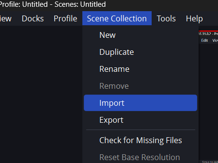
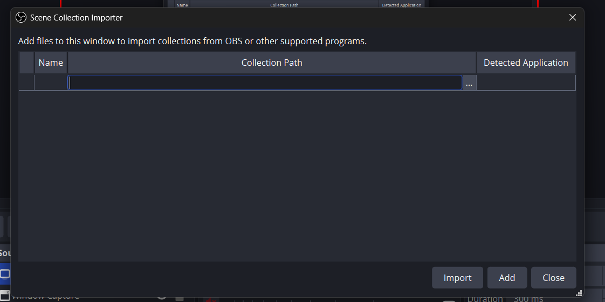
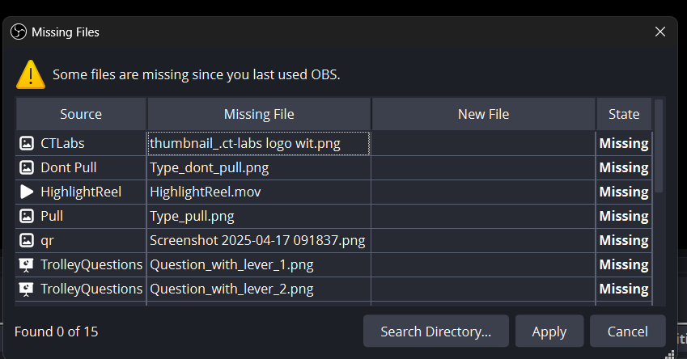
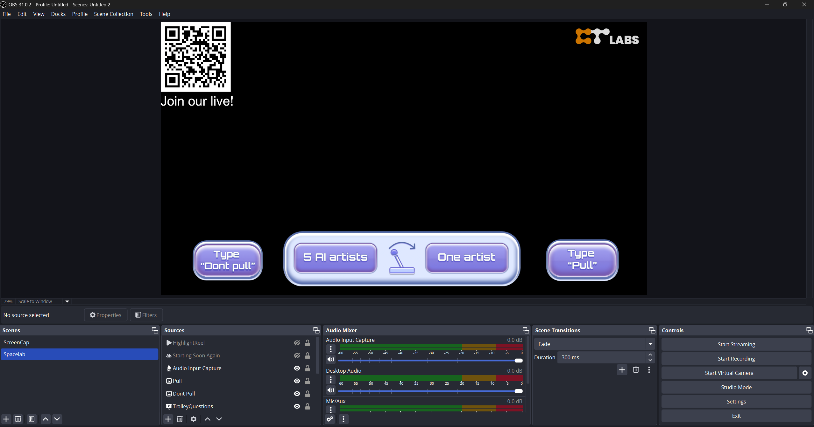
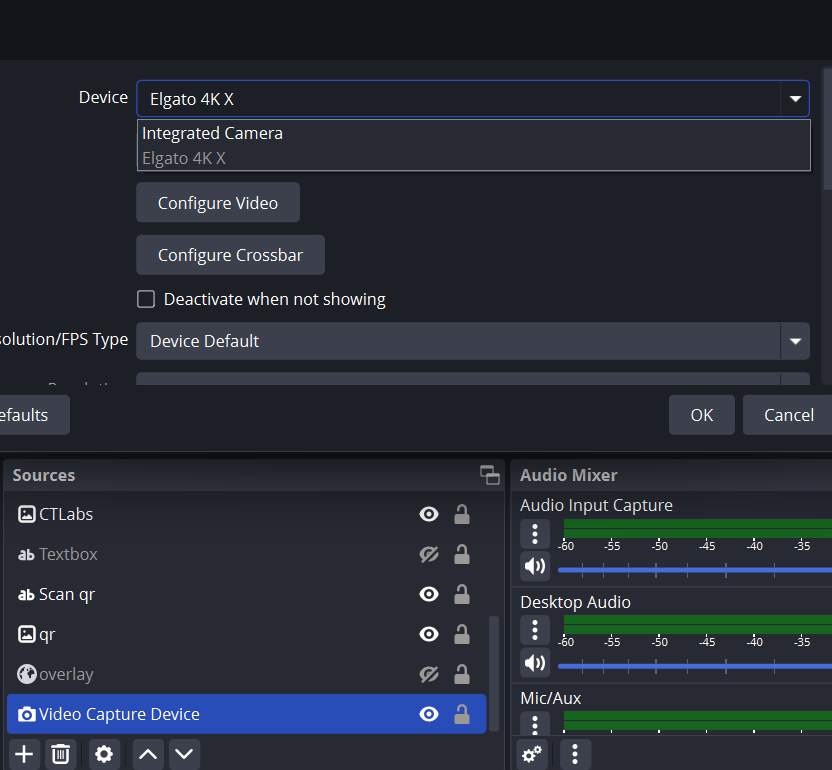

## Setting up OBS
- Download GameshowScene.json and download everything under the Assets folder
- Import GameshowScene.json into OBS under `Scene Collection > Import`
  
- Click the 3 dots and select `GameshowScene.json`.
  
- Then click Import
- Under Scene Collection switch to the new scene
- There will be a bunch of missing assets. Click Search Directory
  
- Navigate to the directory with all the files under `Assets` This should fill in all the fields under `New File`
- Then hit `Apply`. You should now see everything set up.
  
- You might need to Add all the audio inputs for the microphones each contestant and the host will have.
- You might also need to set up the capture of the camera so you dont just see a black screen. If you have plugged in the capture card into your computer/laptop with obs then under sources double click the `Video Capture Device` and change the Device to the capture card
  